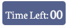

# __General Knowledge Quiz - Portfolio Project 2__

Welcome to my Quiz!

This general knowledge quiz tests the minds ranging from young to old. The questions are randomly generated and are presented with four possible answers to choose from but only one being the correct answer. After finishing the quiz, the score will be feedbacked to the user and they can restart the quiz if they choose to.

## Live Site
[General Knowledge Quiz](https://lestercuasay.github.io/Project-2/)

## Repository
https://github.com/LesterCuasay/Project-2

## __Table of Contents__
- [Objective](#objective)
- [Goals](#goals)
- [UX & Design](#ux--design)
    - [User Stories](#user-stories)
- [Initial Concept](#initial-concept)
    - [Wireframes](#wireframes)
    - [Colour Scheme](#colour-scheme)
    - [Typography](#typography)
- [Features](#features)
    - [Logo and Navigation Bar](#logo-and-navigation-bar)
    - [Main Image](#main-image)
    - [Footer](#footer)
    - [Back to Top](#back-to-top)
    - [Contact Form](#contact-form)
    - [Back to Home](#back-to-home)
    - [Video](#video)
- [Technologies Used](#technologies-used)
    - [Languages Used](#languages-used)
- [Testing](#testing)
- [Bugs](#bugs)
    - [Current Bugs](#current-bugs)
    - [Resolved Bugs](#resolved-bugs)
- [Deployment](#deployment)
    - [GitHub Pages](#github-pages)
    - [Forking the GitHub Repository](#forking-the-github-repository)
    - [Making a Local Clone](#making-a-local-clone)
- [Credits](#credits)

***
## __Objective__
In this project I intend to make a quiz that is responsive with mobile, tablet and desktop. The project is also intended to implement the use of HTML, CSS and Javascript.
___
### __Goals__
In this project I intent to create a quiz that tests the knowledge of the users no matter their age group.

- An intro page showing rules of the quiz.
- A well structured quiz area.
- A feature showing if the answer was correct or incorrect.
- An opportunity to restart the quiz to get a better result.

***
## __UX & Design__

### User Stories
 - As a first time user, I want to be able to figure out what the application is intented for so that I can use it with ease.
 - As a user, I want clear indication whether I got the answer correct or incorrect so that I am aware.
 - As a user, I want to be able to see my score at the end so that I can check how I did.
 - As a returning user, I want to be able to restart the quiz so that I can try and improve my score.
 
 ***
 ## __Initial Concept__

 I hope to deliver a quiz that is simple to use for the user with no conflicting colours to distract them. The application also needs to be easily navigated throughout different devices such as desktop, tablet or mobile devices.

 ### Wireframes
 ___
 As part of the planning stage, I created wireframes for desktop and mobile using [Figma](https://www.figma.com/). This allowed me to have a scratch idea on how to go ahead with the application.

 The layout I created on figma, I have followed throughout making the application but throughout the project I have added more features to make it better for users to use.

 
 - The layout throughout the application is consitent to the intro page making the application flow thus being easier to navigate for users.

 
 - The only difference in this layout is the text indicating to users that the quiz has started.

### Colour Scheme
___

I used [Coolors.co](https://coolors.co/) to choose my colour scheme.

The body background I have chosen for this application is #5c6d99 which is Blue Yonder. The background for the main areas I used #fff which is White and the text colour for that being #131515 Eerie Black.

But in some cases where the background is #5c6d99 for the buttons I used #fff as the text colour for better readability.

I have also used #54648c Dark Blue Gray as a hover effect on the buttons.

### Typography
___

For the Application, I am using [Google Fonts](https://fonts.google.com/). 
I decided to use Catamaran as the heading text for the application and Neuton for the rest of the text.

For the font pairings I used [Fontjoy](https://fontjoy.com/)

***
## __Features__

- This feature is located at the intro page of the quiz, clicking this button will start the quiz.

- This feature shows how many question is left and what number of question you are on. It will increment every time the next question button is clicked.

- This feature is a countdown, the user has 30 seconds to answer the question and move on to the next question.

- This features lets the user know if the answer they have chosen is correct or wrong when they click the "Next Question" button.

- When the timer reaches 0 the user will be alerted that they have ran out of time and the quiz will reload back to the intro page.

- This feature pops up when the user tries to click the "Next Question" button without picking an option.

- This feature enables the user to move on to the next question after picking an answer to the question.

- This feature pops up at the end of the quiz if the user got all of the questions right.

- This feature pops up at the end of the quiz if the user got half of the questions right.

- This feature pops up at the end of the quiz if the user got less than half of the questions right.

- At the results page, if the user wants to restart the quiz they will be able to by clicking this button and it will take them back to the intro page.

- This feature is seen both at the intro page and the quiz page, they are links to my [LinkedIn](https://www.linkedin.com/in/lester-cuasay/) profile and [GitHub](https://github.com/LesterCuasay?tab=repositories) profile. Both the links will be opened in a new tab.

***
## __Technologies Used__

### Languages Used

- [HTML](https://en.wikipedia.org/wiki/HTML5)
- [CSS3](https://en.wikipedia.org/wiki/CSS)
- [Javascript](https://www.javascript.com/)

### Libraries & Frameworks

- [Google Fonts](https://fonts.google.com/)
- [Font Awesome](https://fontawesome.com/)

### Tools

- [Figma](https://www.figma.com/)
- [W3C Validator](https://validator.w3.org/)
- [W3C Validator - Jigsaw](https://jigsaw.w3.org/css-validator/)
- [JShint](https://jshint.com/)
- [GitPod](https://www.gitpod.io/)
- [GitHub](https://github.com/)

***
## __Testing__

[Testing](TESTING.md) (Seperate ReadMe)

***
## __Bugs__

### Current Bugs

There are no bugs I am currently aware of.

### Resolved Bugs

Bug 75c801: The intro container was not going into the middle of the screen.

Fix: Added a position property to the container.

Bug 0964c4: The timer for the quiz was not displaying properly.

Fix: Added a function called "displayTime" and called it outside of the function and the timer was showing properly.

Bug fd266d: The question counter was being incremented when clicking "Next Question" even without the user choosing an answer.

Fix: Moved the placement of incrementQuestion function call into the nextQuestion function.

Bug 017dff: No semi-colons in script.js

Fix: Added semi-colons to where it was needed.

Bug f4b678: The variable "comment" had no global constant.

Fix: Made a constant variable for "comment".

## __Deployment__

### GitHub Pages
This site was deployed using GitHub Pages using these steps:

1. Log in to GitHub and go to the project [GitHub Repository](https://github.com/LesterCuasay?tab=repositories)
2. Locate the Navbar of the project and click on Settings tab.
3. On the settings on the left hand side, locate "Pages" under "Code and automation".
4. On the Branch where it says "None" click the drop down and click select "Main" and click save.
5. The page will automatically refresh.
6. A notification will appear at the top of the settings page with a [link](https://lestercuasay.github.io/Project-2/) to the deplyed site. You can return to this GitHub Pages section to access the link.
___
### Forking the GitHub Repository

Forks are used to be able to change someone else's project as your own idea. By forking the Github Respository you make a copy of the original on your GitHub account to view/or make changes without affecting the original repository.

To Fork a Github Repository:
1. Log in to GitHub and go to the project [GitHub Repository](https://github.com/LesterCuasay?tab=repositories)
2. Locate the Fork button in the top-right corner of the page and click Fork.
3. You should now have a copy of the original repository in your GitHub Account.
___
### Making a Local Clone

To Clone the repository: 
1. Log in to GitHub and go to the project [GitHub Repository](https://github.com/LesterCuasay?tab=repositories)
2. On the repository page, find and click on the 'Code' menu in the middle of the screen.
3. There are multiple ways of doing this next step:
    - To clone the repository using HTTPs, under "Clone with HTTPS", click 'copy' icon.
    - To clone the repository using an SSH key, including a certificate issued by your organisation's SSH certificate authority, click 'Use SSH', then click the 'copy' icon.
    - To clone a repository using GitHub CLI, click 'Use GitHub CLI', then click the 'copy' icon.
4. Open Git Bash.
5. Change the current working directory to the locaiton where you want the clone directory.
6. Type 'git clone', and paste the URL you copied.
7. Press Enter.

For more information about Forking, click on this [GitHub Guide](https://docs.github.com/en/github-ae@latest/get-started/quickstart/fork-a-repo).

## __Credits__

- The icons on the footer are from [Font Awesome](https://fontawesome.com/)
- The fonts are from [Google Fonts](https://fonts.google.com/)
- The questions are from [Radio Times](https://www.radiotimes.com/quizzes/pub-quiz-geography/)

