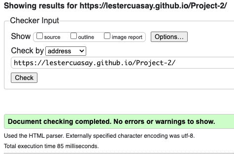
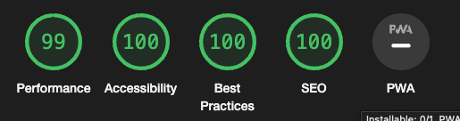
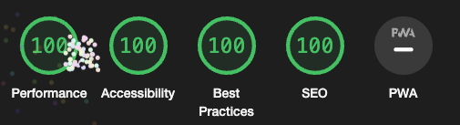

# __Testing__

## Introduction

To make sure that my application is running as intended, I will be using different tools to see its perfomance.

- I will put my application through lighthouse for PC and Mobile.
- I will check the HTML code through [W3C Validator](https://validator.w3.org/)
- I will check the CSS code through [W3C Validator - Jigsaw](https://jigsaw.w3.org/css-validator/)
- I will check the Javascript code through [JShint](https://jshint.com/)

## __Browser Testing__

- Firefox - No errors identified.
- iPhone(Mobile) - No errors identified.
- Microsoft Edge - No errors identified.
- Chrome - This is the browser I have tested the most as I used chrome to build the application.

***

## __W3C HTML Validator__

- HTML code has passed through the validator with no errors found.

## __W3C CSS Validator__

- CSS code has passed Jigsaw with no errors found.

    

## __JShint__

- JShint has no errors, although it has two unused variables "submitBtn" and "submitAnswer" these variables was exported and used in the HTML which is stated at line 199 of the script.

## __Lighthouse__

- As my application is single page the lighthouse results covers the entirety of the app.

### Mobile

### Desktop

        
